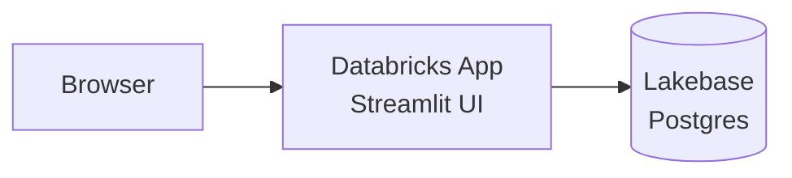

# Deployment Runbook: Support Ticket App on Databricks Apps + Lakebase

> **Two ways to deploy.** You can either let **Claude Code run the whole thing end-to-end** (Section 0 below — you set up credentials once, then it executes every step for you), or follow the **manual click-by-click guide** (Sections 1–10). Section 0 explains what must be configured for the automated path; if you'd rather do it yourself, skip to Section 1.

---

## 0. Let Claude Code deploy this end-to-end (automated path)

For Claude Code to provision Lakebase, create the app, and deploy it for you, **four things must all be true**. None are set up by default — this session runs in a sandboxed container that can't reach Databricks until you configure them.

| # | What | Why it matters |
|---|---|---|
| 1 | **Databricks CLI in the session** | The tool used to create instances/apps and deploy. Claude installs it once #2–3 exist. |
| 2 | **Credentials (auth)** | An identity + secret so the CLI can act as you. |
| 3 | **Network egress to your workspace** | The container sits behind an egress proxy. Outbound HTTPS to your workspace host must be **allowed by the environment's network policy** — the most likely blocker. |
| 4 | **Permissions on that identity** | It must be entitled to create Lakebase instances + Apps and to deploy. |

### 0.1 Credentials — pick one path

**Path A — Personal Access Token (fastest)**
1. In your workspace: avatar → **Settings → Developer → Access tokens → Generate new token**. Copy it.
2. Note your workspace URL: `https://<...>.cloud.databricks.com` (AWS), `...azuredatabricks.net` (Azure), or `...gcp.databricks.com` (GCP).

**Path B — Service principal (recommended for automation)**
1. **Settings → Identity and access → Service principals → Add**, then generate an **OAuth secret** (client ID + secret).
2. Grant it the entitlements in 0.4. This keeps the "deployer" identity separate from the app's own runtime service principal, and is easily revocable.

### 0.2 Store the secrets in the environment (NOT in chat, NOT in the repo)

Set these as **environment variables on the Claude Code environment** (environment settings at claude.ai/code — see <https://code.claude.com/docs/en/claude-code-on-the-web>). Never paste a token into the conversation or commit it to git.

- Path A: `DATABRICKS_HOST=https://<workspace-url>` and `DATABRICKS_TOKEN=<token>`
- Path B: `DATABRICKS_HOST=…`, `DATABRICKS_CLIENT_ID=…`, `DATABRICKS_CLIENT_SECRET=…`

### 0.3 Network egress

The environment's **network policy** must permit outbound HTTPS to your workspace host (`*.cloud.databricks.com` / `*.azuredatabricks.net` / `*.gcp.databricks.com`). If the environment is on a restrictive policy, deployment can't reach Databricks regardless of credentials — you'd need an environment whose policy allows that host. This is the one item that cannot be worked around from inside the sandbox.

### 0.4 Permissions the identity needs

- Workspace access (Workspace admin, or a user/SP with the rights below)
- **Lakebase**: entitlement to **create database instances**
- **Databricks Apps**: permission to **create and deploy apps**
- **Unity Catalog**: any catalog/schema privileges your setup requires
- Ability to run the runtime `GRANT`s as the instance owner (Section 5)

### 0.5 Optional: make every session deploy-ready automatically

Add a **SessionStart hook / setup script** that installs the CLI and verifies auth on each fresh session:

```bash
curl -fsSL https://raw.githubusercontent.com/databricks/setup-cli/main/install.sh | sh
databricks current-user me   # fails loudly if auth or egress isn't working
```

### 0.6 What Claude Code then does for you

Install the CLI → `databricks current-user me` to confirm auth + egress → create the Lakebase instance → run `scripts/init_db.py` (schema + sample data) → create the App → attach the Lakebase resource and set env vars → run the `GRANT`s → `databricks sync` + `databricks apps deploy` → run the Section 9 test checklist and report back. In short, Sections 1–10 executed rather than done by hand.

> **First live check:** once `DATABRICKS_HOST` and the secret are set, `databricks current-user me` is the single command that confirms both auth and egress at once. If it fails on the network, the fix is the environment's network policy (0.3); if it fails on auth, it's the credentials (0.1).

---

## The manual path (Sections 1–10)

This is a click-by-click guide to deploying this app by hand. It assumes you have a Databricks workspace but have **never** used Lakebase or Databricks Apps before. Every term is explained on first use. Follow the sections in order.

**Key terms used throughout:**

- **Databricks App** — a web application (here, a Streamlit UI) that Databricks hosts and runs for you inside your workspace.
- **Streamlit** — a Python framework for building simple web UIs. It's what renders this app's pages.
- **Lakebase** — Databricks' fully managed PostgreSQL ("Postgres") database. Postgres is a popular open-source relational database.
- **Service principal** — a non-human identity (like a robot account) that the deployed app runs as. It has its own permissions, separate from you.
- **OAuth token** — a short-lived password (60-minute lifetime) that Databricks generates to prove identity. Lakebase uses these as the database password instead of a fixed secret.

---

## 1. Overview & Architecture

This app is a support-ticket tracker. The browser talks to a Streamlit web app hosted by Databricks Apps, which reads and writes ticket data in a Lakebase (managed Postgres) database. All ticket data lives in the database, so it survives restarts and is shared across users.



Plain-text version: **Browser → Databricks App (Streamlit) → Lakebase Postgres**

**No passwords or secrets are hard-coded anywhere.** The deployed app uses its own Databricks identity to automatically mint a fresh, short-lived OAuth token every time it connects to the database. There is nothing to leak and nothing to rotate by hand.

---

## 2. Prerequisites

You need the following before starting.

**A Databricks workspace** where you have permission to:
- Create **database instances** (Lakebase databases), and
- Create **apps** (Databricks Apps).

If you're not sure you have these permissions, ask your workspace admin.

**Python 3.11 or newer** on your local machine (needed for the schema/seed step in Section 4). Check with:

```bash
python --version
```

**The Databricks CLI** (command-line tool for controlling Databricks from your terminal).

> Note: The old `pip install databricks-cli` package is **deprecated** — do not use it. Install the new unified `databricks` CLI instead.

Install it one of these ways:

```bash
# macOS / Linux (official install script)
curl -fsSL https://raw.githubusercontent.com/databricks/setup-cli/main/install.sh | sh
```

```bash
# macOS with Homebrew
brew install databricks
```

Verify the install:

```bash
databricks --version
```

**Authenticate the CLI** to your workspace. Replace `<workspace-url>` with your workspace URL (looks like `https://dbc-xxxxxxxx-xxxx.cloud.databricks.com`):

```bash
databricks auth login --host <workspace-url>
```

This opens a browser to log you in. Once done, the CLI can act as you.

---

## 3. Create a Lakebase Database Instance

A **database instance** is a running Lakebase (Postgres) server. You'll create one and record its name.

### Option A — Using the UI (recommended for first-timers)

1. In the left sidebar of your workspace, click **Compute**.
2. Click the **Database instances** tab.
3. Click **Create database instance** (top right).
4. Give it a **name** — for example `support-db`. Write this down; you'll use it everywhere as `LAKEBASE_INSTANCE_NAME`.
5. Accept the default size unless you have a reason to change it, and click **Create**.
6. Wait for the instance status to become **Available** (this can take a few minutes).
7. On the instance's detail page, find the **read/write DNS hostname** (a value like `instance-xxxx.database.cloud.databricks.com`). Write this down — it is your `PGHOST`.

### Option B — Using the CLI

```bash
databricks database create-database-instance <LAKEBASE_INSTANCE_NAME> --capacity CU_1 --output json
```

Replace `<LAKEBASE_INSTANCE_NAME>` with your chosen name (e.g. `support-db`).

> **Two easy mistakes here.** The name is a **positional argument** — `--name <NAME>` is not a valid flag and fails. And `--capacity` is listed as optional in `--help` but the API rejects the request without it (`Field instance.capacity must be defined`). `CU_1` is the smallest SKU.

The command waits until the instance reaches `AVAILABLE` and prints the instance JSON. Read `read_write_dns` from that output — that is your `PGHOST`, so you don't need to open the UI. (It's also on the instance page under Compute → Database instances.)

### Record these values

| Value | Where it comes from | Example |
|---|---|---|
| `LAKEBASE_INSTANCE_NAME` | the name you chose | `support-db` |
| `PGHOST` | read/write DNS hostname on the instance page | `instance-xxxx.database.cloud.databricks.com` |
| `PGDATABASE` | default database name | `databricks_postgres` |
| `PGPORT` | Postgres port | `5432` |
| `PGSSLMODE` | encryption mode | `require` |

---

## 4. Create the Schema and Load Sample Data

Now you'll create the database tables (`tickets` and `ticket_messages`) and load sample rows. This is a one-time setup you run from **your local machine** using **your own Databricks identity**.

### First: generate an OAuth token to use as the database password

Lakebase uses a short-lived OAuth token as the Postgres password. Generate one with the CLI:

```bash
databricks database generate-database-credential --instance-names <LAKEBASE_INSTANCE_NAME>
```

This prints a JSON response containing a `token` field. Copy that token value — it's your `PGPASSWORD`.

> **Tokens expire after 60 minutes.** If any step below fails with an authentication error, just re-run this command to get a fresh token and re-export `PGPASSWORD`.

### Set your environment variables

In the same terminal, export these (fill in the `<...>` placeholders):

```bash
export LAKEBASE_INSTANCE_NAME="<LAKEBASE_INSTANCE_NAME>"
export PGHOST="<PGHOST>"                 # read/write DNS hostname from Section 3
export PGDATABASE="databricks_postgres"
export PGPORT="5432"
export PGUSER="<your-databricks-username>"   # from `databricks current-user me`
export PGSSLMODE="require"
export PGPASSWORD="<paste-the-token-from-above>"
```

- `PGUSER` for this manual step is **your own Databricks username**. You are connecting as yourself. Don't assume it matches the email you sign in to other services with — read the exact value from `databricks current-user me` (the `userName` field). A one-character difference produces a confusing `password authentication failed`.
- `PGPASSWORD` is the OAuth token you just generated. You can skip setting it entirely if you leave `PGHOST`/`PGUSER`/`PGPASSWORD` unset and set only `LAKEBASE_INSTANCE_NAME` — `db.py` then mints a token through the SDK using your CLI login, exactly as the deployed app does.

### Option A (recommended): run the provided init script

The repo includes `scripts/init_db.py`, which connects to Lakebase and runs `sql/schema.sql` then `sql/seed_data.sql` for you.

From the repository root:

```bash
pip install -r requirements.txt
python scripts/init_db.py
```

On success you'll have two tables (`tickets`, `ticket_messages`) with sample tickets loaded.

### Option B (alternative): use psql directly

`psql` is the standard Postgres command-line client. If you have it installed and prefer it, connect using the same environment variables:

```bash
psql "host=$PGHOST port=$PGPORT dbname=$PGDATABASE user=$PGUSER sslmode=$PGSSLMODE"
```

(`psql` automatically reads `PGPASSWORD` from the environment.) Then, at the `psql` prompt, run the two SQL files from the repo root:

```sql
\i sql/schema.sql
\i sql/seed_data.sql
```

Type `\q` to quit.

---

## 5. Grant the App's Service Principal Access to the Database

The deployed app does **not** run as you — it runs as its own **service principal** (a robot identity). That service principal needs its own Postgres role with permission to read and write your tables.

> **Ordering note:** The service principal ID is only shown **after** you create the app in **Section 6**. So you will likely do Section 6 first, come back here with the ID, then run these grants. That's expected — this section is placed here because it's conceptually part of database setup, but it depends on Section 6. **Do Section 6, then return here.**

Once you have the service principal ID (the app's `service_principal_client_id`, a UUID like `a1b2c3d4-e5f6-4a7b-8c9d-0e1f2a3b4c5d`), connect to the database **as the instance owner** (that's you — use the same `psql` connection from Section 4, or the init approach, with a fresh token if needed).

> **The `CREATE ROLE` below is usually unnecessary.** If you attached the Lakebase instance as an app resource when the app was created (Section 6 / 7), Databricks has **already created the Postgres role** for the service principal, with `LOGIN`. Running `CREATE ROLE` then fails with `role already exists`. Check first:
>
> ```sql
> SELECT rolname, rolcanlogin FROM pg_roles WHERE rolname = '<service-principal-id>';
> ```
>
> If it returns a row, skip straight to the `GRANT`s. What Databricks does *not* do for you is grant privileges on tables **you** created — that's why the rest of this section still matters, and why skipping it produces `permission denied for table`.

Run this SQL, replacing `<service-principal-id>` with the real ID (keep the double quotes — the UUID is not a valid bare identifier):

```sql
-- Create a Postgres role for the app's service principal.
-- SKIP THIS if the query above already returned a row (the usual case).
CREATE ROLE "<service-principal-id>" WITH LOGIN;

-- Let the role use the schema.
GRANT USAGE ON SCHEMA public TO "<service-principal-id>";

-- Give it full access to the existing tables.
GRANT ALL PRIVILEGES ON ALL TABLES IN SCHEMA public TO "<service-principal-id>";

-- Give it access to sequences (used for auto-incrementing IDs).
GRANT USAGE, SELECT ON ALL SEQUENCES IN SCHEMA public TO "<service-principal-id>";

-- Make sure any tables/sequences created LATER are also accessible.
ALTER DEFAULT PRIVILEGES IN SCHEMA public
    GRANT ALL PRIVILEGES ON TABLES TO "<service-principal-id>";
ALTER DEFAULT PRIVILEGES IN SCHEMA public
    GRANT USAGE, SELECT ON SEQUENCES TO "<service-principal-id>";
```

Verify the grants landed before deploying — this is faster than debugging a broken app:

```sql
SELECT has_table_privilege('<service-principal-id>', 'tickets', 'SELECT') AS can_read,
       has_table_privilege('<service-principal-id>', 'tickets', 'INSERT') AS can_write;
```

Both should be `t`. If the app later shows `permission denied for table`, it almost always means these grants were missed or the wrong ID was used — re-run this block.

---

## 6. Create the Databricks App

A **Databricks App** is the hosted web application that will serve the Streamlit UI.

1. In the left sidebar, click **Compute**.
2. Click the **Apps** tab.
3. Click **Create app**.
4. Choose a **custom** (blank / bring-your-own-code) app template, not one of the pre-built samples.
5. Give the app a **name** — for example `support-app`. Write it down; you'll use it as `<app-name>` when deploying.
6. Click **Create**.
7. On the app's detail page, find the **service principal** (sometimes labeled "App identity" or "Client ID"). **Copy this ID.**
8. **Go back to Section 5 now** and run the grant SQL with this ID before continuing.

### Faster: create the app with the database already attached

The CLI can create the app *and* attach the Lakebase resource in a single call, which collapses the Section 6 → 5 → 7 round-trip. `databricks apps create` has no `--resources` flag, but `--json` accepts the full request body:

```bash
cat > app-create.json <<'JSON'
{
  "name": "support-app",
  "description": "Milford Support Desk",
  "resources": [
    {
      "name": "lakebase",
      "database": {
        "instance_name": "<LAKEBASE_INSTANCE_NAME>",
        "database_name": "databricks_postgres",
        "permission": "CAN_CONNECT_AND_CREATE"
      }
    }
  ]
}
JSON

databricks apps create --json @app-create.json --output json
```

The response contains `service_principal_client_id` — the ID Section 5 needs — and the resource attachment of Section 7 is already done. You still need the `GRANT`s in Section 5.

---

## 7. Attach Lakebase and Set Environment Variables

The app needs to know which database to talk to. You attach the Lakebase instance as a **resource** (a dependency the app is allowed to use) and set a few environment variables.

### Attach the Lakebase instance as a resource

1. On the app's detail page, find the **Resources** (or **Dependencies**) section and click **Add resource** / **Edit**.
2. Choose **Database instance** and select the Lakebase instance you created in Section 3 (`<LAKEBASE_INSTANCE_NAME>`).
3. Save. This authorizes the app's service principal to request tokens for that instance.

### Set the environment variables

Set these in the app's configuration (in the UI's **Environment** / **App settings** section, or in the `env:` block of `app.yaml` in the repo — either works):

| Variable | Value |
|---|---|
| `LAKEBASE_INSTANCE_NAME` | `<LAKEBASE_INSTANCE_NAME>` (e.g. `support-db`) |
| `PGDATABASE` | `databricks_postgres` |
| `PGHOST` | `<PGHOST>` (read/write DNS hostname) |
| `PGSSLMODE` | `require` |

If you're editing `app.yaml`, the block looks like:

```yaml
env:
  - name: LAKEBASE_INSTANCE_NAME
    value: "<LAKEBASE_INSTANCE_NAME>"
  - name: PGDATABASE
    value: "databricks_postgres"
  - name: PGHOST
    value: "<PGHOST>"
  - name: PGSSLMODE
    value: "require"
```

> **Do NOT set `PGPASSWORD` here.** Leaving it unset is intentional. The deployed app mints its own fresh OAuth token on every connection using the Databricks SDK (via `w.database.generate_database_credential(...)`), so there is no static password to store. `PGUSER` and `PGHOST` are also derived automatically by the app if omitted, but setting `PGHOST` explicitly avoids an extra lookup.

---

## 8. Deploy the Code

Now push the repository to your workspace and deploy it to the app. Run these from the **repository root** (`/home/user/Databricks-itsm` or wherever you have it).

Replace `<you>` with your Databricks username (the workspace path uses it), and `<app-name>` with the app name from Section 6.

**Step 1 — Sync the repo folder into your workspace:**

```bash
databricks sync --watch . /Workspace/Users/<you>/support-app
```

This uploads your local files to `/Workspace/Users/<you>/support-app` and (with `--watch`) keeps re-uploading on change. You can stop it with `Ctrl+C` once the initial sync completes if you don't need live watching.

**Step 2 — Deploy from that workspace path:**

```bash
databricks apps deploy <app-name> --source-code-path /Workspace/Users/<you>/support-app
```

The app automatically installs everything in `requirements.txt` during deployment — you don't install dependencies by hand. When deployment finishes, open the app's URL (shown on the app detail page in the UI).

> The app starts with the command in `app.yaml`: `streamlit run app.py --server.port=8000 --server.address=0.0.0.0`. Databricks Apps routes traffic to **port 8000**, so this port must not change.

---

## 9. Test Checklist

Open the app's URL and verify each item. Each one exercises the database, so passing them all proves data really lives in Lakebase.

- [ ] **Existing tickets load** — the sample tickets from Section 4 appear.
- [ ] **Create a new ticket** — add one; it shows up in the list.
- [ ] **Add a message** — open a ticket and post a message; it appears in the thread.
- [ ] **Update a ticket's status** — change a status (e.g. Open → Closed); the new status sticks.
- [ ] **Delete a ticket** — delete one and confirm the confirmation prompt; it disappears.
- [ ] **Refresh the browser** — reload the page and confirm every change above is still there. If it persists after a refresh, the data is stored in Lakebase (not in app memory).

---

## 10. Troubleshooting

| Symptom | Likely cause & fix |
|---|---|
| `permission denied for table` | The service principal is missing grants. Re-run the SQL in **Section 5** with the correct service principal ID from the app page (Section 6). |
| `password authentication failed` / token expired | Your OAuth token expired (60-min lifetime). For manual steps, regenerate it (Section 4) and re-export `PGPASSWORD`. For the deployed app, redeploy (Section 8) — it mints tokens automatically, so this usually means a transient issue or a stale deploy. |
| App shows a connection error | Check the app's environment variables. `LAKEBASE_INSTANCE_NAME` and `PGHOST` must be correct (Section 7), and the Lakebase instance must be attached as a resource. |
| Blank page or "site can't be reached" / wrong port | Ensure `app.yaml` runs Streamlit on port 8000: `--server.port=8000 --server.address=0.0.0.0`. Databricks Apps only routes to port 8000. |
| `psycopg` build / compilation errors during install | Make sure `requirements.txt` uses `psycopg[binary]` (the pre-compiled wheel), not plain `psycopg`. The `[binary]` extra avoids needing a C compiler. If you're on a very new Python (3.14+), no binary wheel may exist yet — create the venv with an older interpreter, e.g. `python3.12 -m venv .venv`. |
| `Field instance.capacity must be defined` | `databricks database create-database-instance` needs `--capacity` even though `--help` shows it as optional. Use `--capacity CU_1`. |
| `fastapi ... requires starlette<0.39.0, but you have starlette 1.3.1` in the build log | Harmless. Streamlit pulls a newer `starlette` over the one in the Apps base image. Nothing in this app uses FastAPI; the deployment still succeeds. |
| Deployed app can't reach the database, but local scripts can | The Lakebase instance isn't attached to the app as a **resource** (Section 7). Without it the app's service principal cannot mint a token for the instance, no matter what the grants say. |

---
_Generated by [Claude Code](https://claude.ai/code)_
